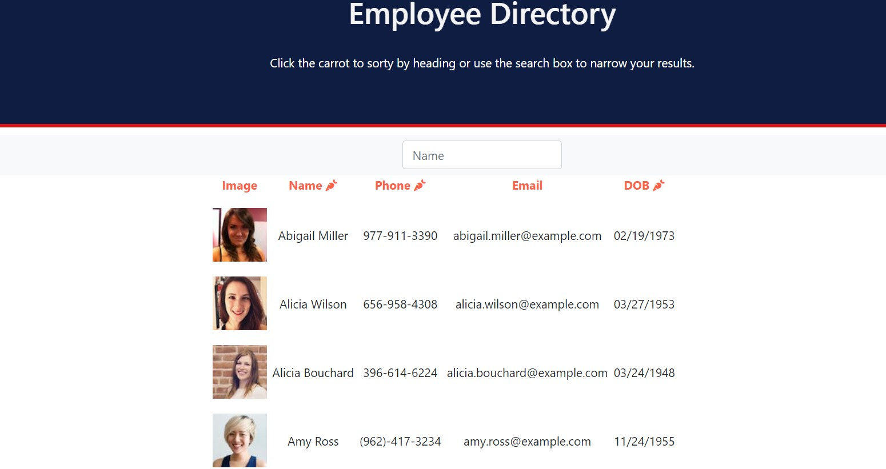

# 
 **Employee Directory** 

## **Table Of Contents** 

---

1. [Description](#description)
2. [Installation](#installation)
3. [Deployment](#github)
4. [Contact](#contact)

--- 

This app allows users to view employees in a directory containing an image, first and last name, phone number, email address, and date of birth. The employees can be sorted in ascending or descending order by name, phone, or date of birth. There is also a search box that can be used to filter employeees by name as the name is typed. 

--- 

--- 

## 
 **Installation** 

--- 

<li>If you would like to download it locally, clone the repo and run `npm i`.  This will install all dependencies</li>
<li>Initialize the app in the command line with `npm start` </li>
<li>In the command line note which port the server is being run on and input `localhost:{givenPORT}` in the browser</li>
</ol>

---

## 
 **Deployment** 

---

<ul>
   <li>

### _Github Repository:_ https://github.com/markkimeyer/budget-tracker
</li>
<li>

### _Github Pages:_ https://mmbudget-tracker.herokuapp.com/
</li>
<li>

---

## 
 **Contact** 

---

 Email: markkimeyer@gmail.com 

